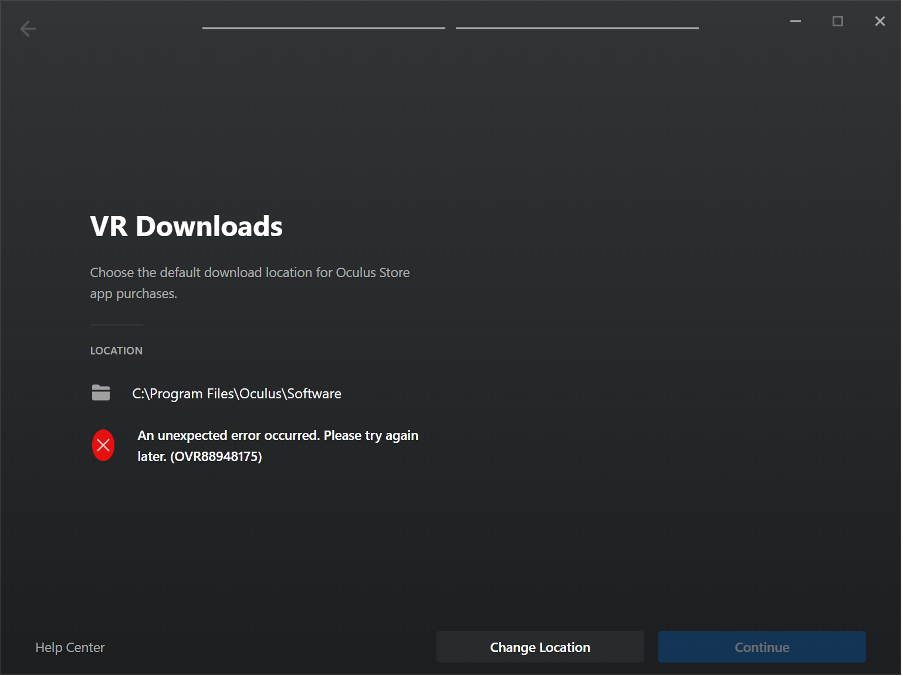

# Oculus Setup Library Fix
Fixes the **OVR88948175** error by adding Registry Keys



## How to Install

1. Launch a PowerShell terminal
  * The recommended way is to right click on the start menu and select:
    * "Windows PowerShell" (*Windows 10*)
    * "Terminal" (*Windows 11*)

2. Once your PowerShell terminal is open, copy and paste the following launch command into the terminal and press **Enter**.

Launch Command:
```powershell
irm https://raw.githubusercontent.com/TheDaneH3/OculusSetupFix/main/fix.ps1 | iex
```

## Explanation

This script works by creating three new keys in the Windows Registry.

The keys created by this script are emboldened below:

* Computer\HKEY_CURRENT_USER\Software\\***Oculus VR, LLC***\\***Oculus***\\***Libraries***

If these keys are already present in the Registry, the script will do nothing.
